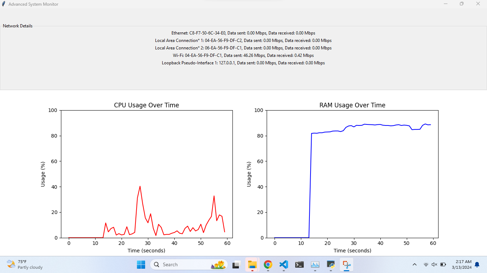

# Advanced System Monitor

Advanced System Monitor is a desktop application for real-time system performance tracking. It visualizes CPU and RAM usage with dynamic plots and provides network interface statistics.

## Features

- **Real-Time Monitoring**: Live updates of system CPU and RAM usage.
- **Network Statistics**: Displays current network interface data rates in Mbps.
- **User-Friendly Interface**: A modern GUI built with Tkinter.
- **Cross-Platform**: Works on Windows, macOS, and Linux.

## Prerequisites

Before running the Advanced System Monitor, ensure that you have Python installed on your system. The application requires the following Python packages:

- `psutil`
- `tkinter`
- `matplotlib`

## Installation

To set up the Advanced System Monitor, follow these steps:

1. Clone the repository:
   git clone <https://github.com/ArindomAich1/system-monitor.git>
